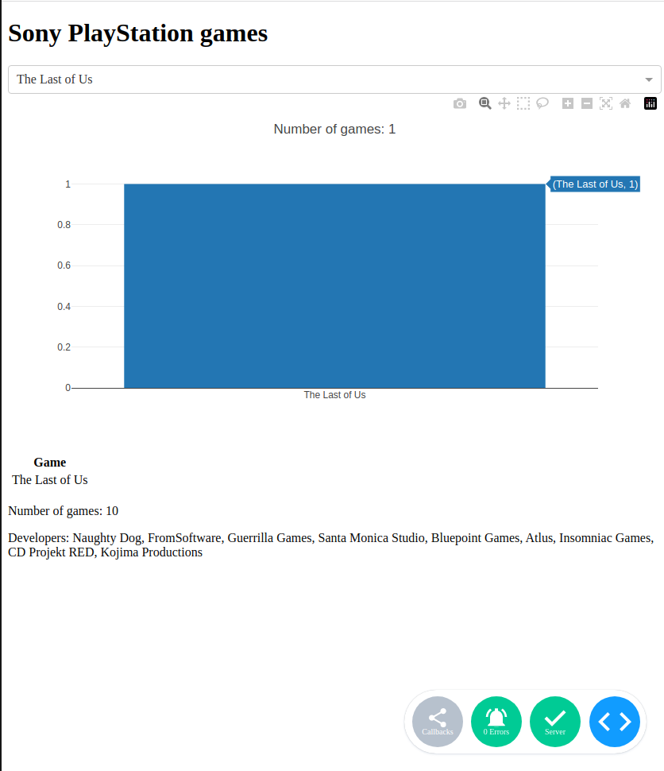

# Dashboard
#### ___This repository was created to create a Dashboard.___
___

* This script is used to display a list of [Sony PlayStation](https://www.playstation.com/uk-ua/) games and to filter and visualize data on a graph and in a table.
* The script starts with importing the necessary libraries:
> [csv](https://uk.wikipedia.org/wiki/CSV),
> [json](https://uk.wikipedia.org/wiki/JSON),
> [pandas](https://pandas.pydata.org/),
> [dash](https://dash.plotly.com/),
> [dcc](https://pypi.org/project/dcc/),
> [html](https://uk.wikipedia.org/wiki/HTML),
> [Input and Output](https://en.wikipedia.org/wiki/Input/output)

* Then, a list of Sony PlayStation games is created and this list is written to CSV and JSON files.
* Next, data is loaded from the CSV file into the variable "data" using the pandas library.
* The Dash application is initialized, and the application layout is defined, consisting of a title, control elements for data filtering, a graph, a table with data, the number of games, and a list of developers.
___
*  A function "update_figure_and_table" is created to update the graph and table when the selected game title in the dropdown control element is changed.
___
* Finally, the Dash application is run with debug mode if the script is run directly.
___

> Dash is running on http://localhost:/
* Serving Flask app 'main'
* Debug mode: on